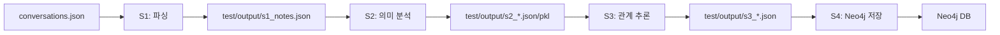

# 프로젝트 구조 및 파일 저장 경로

## 📁 디렉토리 구조

```
taco/
├── analyze/                   # 메인 패키지
│   ├── __init__.py
│   ├── loader.py             # S1: 데이터 로더
│   ├── parser.py             # S1: 노트 파서
│   ├── semantic_analyzer.py  # S2: 의미 분석
│   ├── relationship_builder.py # S3: 관계 추론
│   └── graph_storage.py      # S4: Neo4j 저장
│
├── test/                     # 테스트 스크립트
│   ├── test_s1.py           # S1 테스트
│   ├── test_s2.py           # S2 테스트
│   ├── test_s3.py           # S3 테스트
│   ├── test_s4.py           # S4 테스트
│   └── output/              # ⭐ 테스트 결과물 저장
│       ├── s1_notes.json
│       ├── s1_stats.json
│       ├── s2_embeddings.pkl
│       ├── s2_concepts.json
│       ├── s2_similarities.json
│       ├── s2_stats.json
│       ├── s3_edges.json
│       ├── s3_stats.json
│       ├── s3_graph_data.json
│       └── s4_visualization_data.json
│
├── models/                   # ⭐ 모델 캐시 (자동 생성)
│   └── jhgan_ko-sroberta-multitask/
│       ├── config.json
│       ├── pytorch_model.bin
│       └── ...
│
├── data/
│   └── conversations.json   # 입력 데이터
│
├── main.py                  # 전체 파이프라인 실행
├── requirements.txt         # 의존성
├── .env                     # 환경 변수 (gitignore)
├── .env.example            # 환경 변수 예시
├── .gitignore              # Git 제외 파일
├── README.md               # 메인 문서
└── PROJECT_STRUCTURE.md    # 이 파일
```

## 결과물 저장 경로

### 1. 테스트 출력 (`test/output/`)

각 단계별 테스트를 실행하면 `test/output/` 폴더에 결과물이 저장됩니다.

#### S1 테스트 결과
```bash
python test/test_s1.py
```
생성 파일:
- `test/output/s1_notes.json` - 파싱된 노트 데이터
- `test/output/s1_stats.json` - 통계 정보

#### S2 테스트 결과
```bash
python test/test_s2.py
```
생성 파일:
- `test/output/s2_embeddings.pkl` - SBERT 의미 벡터 (pickle)
- `test/output/s2_concepts.json` - 추출된 핵심 개념
- `test/output/s2_similarities.json` - 노트 간 유사도 매트릭스
- `test/output/s2_stats.json` - 통계 정보

#### S3 테스트 결과
```bash
python test/test_s3.py
```
생성 파일:
- `test/output/s3_edges.json` - 엣지 (관계) 데이터
- `test/output/s3_stats.json` - 통계 정보
- `test/output/s3_graph_data.json` - 그래프 데이터 (노드+엣지)

#### S4 테스트 결과
```bash
python test/test_s4.py
```
생성 파일:
- `test/output/s4_visualization_data.json` - 시각화용 그래프 데이터
- Neo4j 데이터베이스에 직접 저장됨

### 2. 모델 캐시 (`models/`)

SBERT 모델이 처음 다운로드될 때 `models/` 폴더에 저장됩니다.

- **위치**: `taco/models/`
- **크기**: 약 400-500MB
- **재사용**: 다음 실행부터는 다운로드 없이 캐시 사용
- **Git**: `.gitignore`에 포함 (커밋되지 않음)

모델 경로:
```
models/
└── jhgan_ko-sroberta-multitask/
    ├── config.json
    ├── pytorch_model.bin  (약 443MB)
    ├── tokenizer_config.json
    └── ...
```

### 3. Neo4j 데이터베이스

S4 단계에서 Neo4j에 저장되는 데이터:

- **노드**:
  - `Note` - 대화 노트
  - `Concept` - 핵심 개념

- **관계**:
  - `RELATED_TO` - 노트 간 유사도 관계
  - `HAS_CONCEPT` - 노트-개념 연결

- **저장 위치**: Neo4j 데이터베이스 (Docker 또는 Neo4j Desktop)
- **확인**: http://localhost:7474 (Neo4j Browser)

## 🗂️ 파일 크기 가이드

| 파일/폴더 | 크기 (예상) | 설명 |
|----------|------------|------|
| `models/` | ~500MB | SBERT 모델 캐시 |
| `data/conversations.json` | ~60MB | 입력 데이터 |
| `test/output/s1_notes.json` | ~수MB | 노트 데이터 |
| `test/output/s2_embeddings.pkl` | ~수MB | 의미 벡터 |
| `test/output/s2_similarities.json` | ~1-10MB | 유사도 매트릭스 |
| `test/output/s3_edges.json` | ~1-5MB | 엣지 데이터 |

## 🧹 정리 방법

### 테스트 결과물 삭제
```bash
rm -rf test/output/*
```

### 모델 캐시 삭제 (재다운로드 필요)
```bash
rm -rf models/*
```

### Neo4j 데이터베이스 초기화
```bash
python test/test_s4.py  # clear_db=True 옵션 사용
# 또는
python main.py --clear-db
```

### 전체 정리
```bash
rm -rf test/output/* models/*
```

## 📝 환경 변수 (.env)

환경 변수 파일 위치: `taco/.env`

```env
# Neo4j 연결 정보
NEO4J_URI=bolt://localhost:7687
NEO4J_USER=neo4j
NEO4J_PASSWORD=your_password

# 분석 설정
SIMILARITY_THRESHOLD=0.7
MAX_WORKERS=4
```

`.env` 파일은 gitignore에 포함되어 커밋되지 않습니다.

## 🚀 실행 흐름



## 💡 팁

1. **처음 실행 시**: 모델 다운로드로 시간이 걸립니다 (5-10분)
2. **다음 실행부터**: 캐시된 모델을 사용하여 빠릅니다
3. **디스크 공간**: 최소 1GB 이상 확보 권장
4. **테스트 우선**: `test/test_s1.py` 부터 순서대로 실행 추천
5. **샘플 데이터**: `--sample-size` 옵션으로 빠른 테스트 가능

## 🔍 파일 확인

```bash
# 테스트 출력 확인
ls -lh test/output/

# 모델 캐시 확인
ls -lh models/

# 파일 크기 확인
du -sh test/output/
du -sh models/
```
